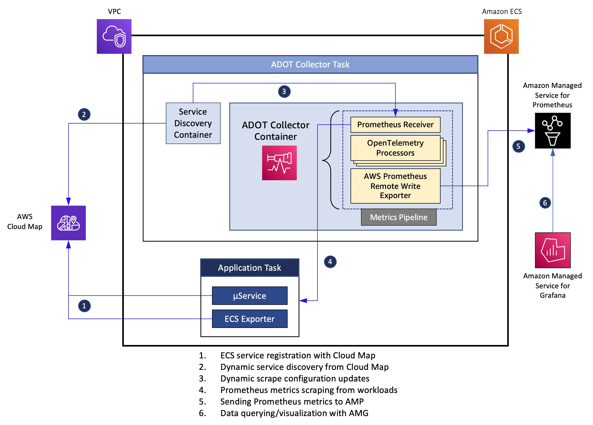

## Metrics and Traces Collection from Amazon ECS using AWS Distro for OpenTelemetry

This directory contains software artifacts to deploy [ADOT](https://aws-otel.github.io/docs/introductions) Collector to an Amazon ECS cluster and collect Prometheus metrics and X-Ray traces from applications, using AWS Cloud Map for dynamic service discovery.



### Solution architecture overview

At a high level, we will be following the steps outlined below for this solution:

<ul>
  <li>
    Setup AWS Cloud Map for service discovery 
  </li>
  <li>
    Deploy application services to an Amazon ECS and register them with AWS Cloud Map
  </li>
  <li>
    Deploy ADOT Collector to Amazon ECS, configure HTTP-based service discovery
  </li>
  <li>
    Setup a metrics pipeline in the collector to scrape Prometheus metrics from workloads and send them to a workspace in Amazon Managed Service for Prometheus
  </li>
  <li>
    Visualize metrics data using Amazon Managed Grafana
  </li>  
  <li>
    Setup a traces pipeline in the collector to collect X-Ray trace segments from workloads and send them to AWS X-Ray
  </li>
  <li>
    Deploy application services instrumented with X-Ray SDK, send trace data to the ADOT Collector and visualize them in AWS X-Ray Service Map.
  </li>
</ul>

### Deploy

Make sure you have the latest version of AWS CLI that provides support for Amazon Managed Prometheus. The deployment requires an ECS cluster. All deployment artifacts are under the [deploy-adot](https://github.com/aws-samples/prometheus-for-ecs/tree/main/deploy-adot) directory. 

The deployment comprises the following components:
- An ECS task comprising the ADOT Collector and the service discovery application containers. The collector has a *metrics* pipeline configured with a [Prometheus Receiver](https://github.com/open-telemetry/opentelemetry-collector-contrib/tree/main/receiver/prometheusreceiver), and an [AWS Prometheus Remote Write Exporter](https://github.com/open-telemetry/opentelemetry-collector-contrib/tree/main/exporter/awsprometheusremotewriteexporter) as shown in the figure above. This enables it to collect Prometheus metrics from workloads and send them to an Amazon Managed Prometheus workspace. It also has a has a *traces* pipeline which comprises an instance of [AWS X-Ray Receiver](https://github.com/open-telemetry/opentelemetry-collector-contrib/tree/main/receiver/awsxrayreceiver) and [AWS X-Ray Exporter](https://github.com/open-telemetry/opentelemetry-collector-contrib/tree/main/exporter/awsxrayexporter) which enables it to collect the trace segments and send them to AWS X-Ray. The [service discovery application](https://github.com/aws-samples/prometheus-for-ecs/tree/main/cmd) helps discover the services registered in AWS Cloud Map and dynamically updates the scrape configurations used by the Prometheus Receiver.

- An ECS task comprising a stateless web application and the [ECS Exporter](https://github.com/prometheus-community/ecs_exporter) containers. The application is instrumented with [Prometheus Go client library](https://github.com/prometheus/client_golang) and exposes an HTTP endpoint */work*. The application has an internal load generator that sends client requests to the HTTP endpoint. The application exposes two custom metrics, namely, a [Counter](https://prometheus.io/docs/concepts/metric_types/#counter) named *http_requests_total* and a [Histogram](https://prometheus.io/docs/concepts/metric_types/#histogram) named *request_duration_milliseconds*. The ECS container agent injects an environment variable named ECS_CONTAINER_METADATA_URI_V4 into each container, referred to as the *task metadata endpoint* which provides various task metadata and [Docker stats](https://docs.docker.com/engine/api/v1.30/#operation/ContainerStats) to the container. The ECS Exporter container reads this data and exports them as Prometheus metrics on port 9779. 

The deploment scripts assume that the underlying ECS cluster was created using the [ecs-cluster.yaml](https://github.com/aws-samples/prometheus-for-ecs/blob/main/deploy-adot/ecs-cluster.yaml) CloudFormation template. 
Create the cluster with the following command:
``` 
VPC_STACK_NAME=ecs-stack 
VPC_TEMPLATE=ecs-cluster.yaml
aws cloudformation deploy --stack-name $VPC_STACK_NAME --template-file $VPC_TEMPLATE --capabilities CAPABILITY_IAM 
```
    
Before proceeding further, export a set of environment variables that are required by scripts used in subsequent steps. Modify the **ACCOUNT_ID** and **AWS_REGION** variables in the *env.sh* script before running the command below.
```
source env.sh
```

Create the ECS task role, task execution roles and the relevant IAM policies.
```
source iam.sh
```

Create a service discovery namespace and service registries under AWS Cloud Map. The ECS tasks that you will deploy will register themselves in these service registries upon launch.
```
source cloudmap.sh
```

Setup ADOT Collector pipeline configurations and an Amazon Managed Prometheus worksapce for ingesting Prometheus metrics scraped from ECS services. 
```
source otel-config.sh
```
The above command creates an Amazon Managed Prometheus workspace named **adot-prometheus-for-ecs** and the ADOT Collector pipeline configuration, with the Amazon Managed Prometheus worksapce set as the destination for AWS Remote Write Exporter in the pipeline. It also creates two parameters in the AWS SSM Parameter Store as follows:
- parameter named **otel-collector-config** and of type *String* which stores the pipeline configuration. The ADOT Collector task will read its pipeline configuration from this parameter.
- parameter named **ECS-Namespaces** and of type *String* with its value set to **ecs-services**. This is the AWS Cloud Map namespace which will be used by the service discovery sidecar in the ADOT Collector task to discover scraping targets.

Next, register task definitions with ECS
```
source task-definitions.sh
```

Launch the ECS services using the task definitions created above. 
```
source services.sh
```

Once the services are all up and running, the Amazon Managed Prometheus workspace will start ingesting metrics collected by the ADOT Collector from the web application. Use AMG to query and visualize the metrics ingested into Amazon Managed Prometheus. You may use the following PromQL queries to visualize the metrics collected from the web application and Prometheus Node Exporter
- HTTP request rate: *sum(rate(http_requests_total[5m]))*
- Average response latency: *(sum(rate(request_duration_milliseconds_sum[5m])) by (path,taskid))/(sum(rate(request_duration_milliseconds_count[5m])) by (path,taskid))*
- Response latency: *sum(rate(request_duration_milliseconds_bucket{le="THRESHOLD"}[5m])) / sum(rate(request_duration_milliseconds_count[5m])) * 100*. The following are the thresholds captured: 500, 1000, 2500, 5000
- Average CPU usage:  *ecs_cpu_percent{container="webapp"}*

### Cleanup

When you are done, cleanup the resources you created above with the follwing set of commands.
```
source cleanup-ecs.sh
source cleanup-cloudmap.sh
source cleanup-iam.sh
source cleanup-ssm.sh
aws cloudformation delete-stack --stack-name $VPC_STACK_NAME
```

## Security

See [CONTRIBUTING](CONTRIBUTING.md#security-issue-notifications) for more information.

## License

This library is licensed under the MIT-0 License. See the LICENSE file.

