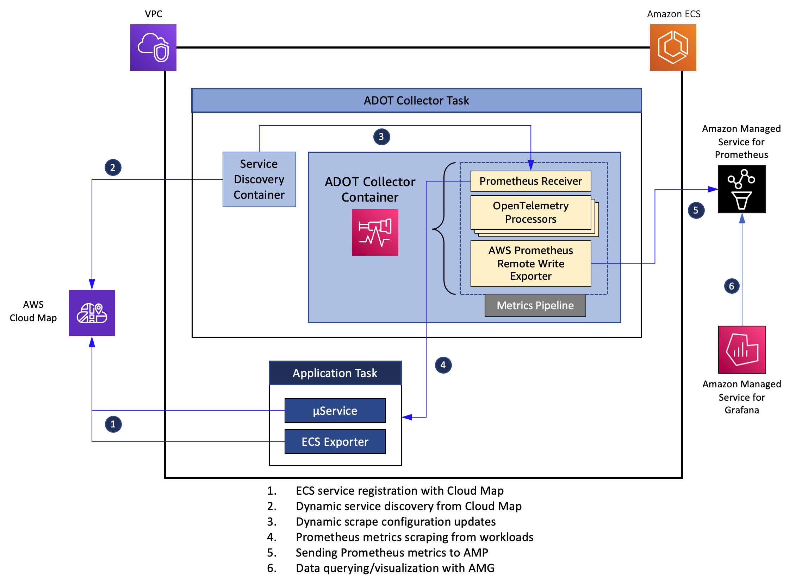

## Metrics Collection from Amazon ECS using AWS Distro for OpenTelemetry

This directory contains software artifacts to deploy [ADOT](https://aws-otel.github.io/docs/introductions) to an Amazon ECS cluster. 



### Solution architecture overview

At a high level, we will be following the steps outlined below for this solution:

<ul>
  <li>
    Setup AWS Cloud Map for service discovery 
  </li>
  <li>
    Deploy application services to an Amazon ECS and register them with AWS Cloud Map
  </li>
  <li>
    Deploy ADOT Collector to Amazon ECS, configure service discovery and send metrics data to Amazon Managed Service for Prometheus (AMP)
  </li>
  <li>
    Visualize metrics data using Amazon Managed Service for Grafana (AMG)
  </li>  
</ul>

### Deploy

Make sure you have the latest version of AWS CLI that provides support for AMP. The deployment requires an ECS cluster. All deployment artifacts are under the [deploy-adot](https://github.com/aws-samples/prometheus-for-ecs/tree/main/deploy-adot) directory. The deployment comprises the following components:
- An ECS task comprising the ADOT Collector and the service discovery application container

- An ECS task comprising a mock stateless web application container and the [ECS Exporter](https://github.com/prometheus-community/ecs_exporter) container. The application is instrumented with [Prometheus Go client library](https://github.com/prometheus/client_golang) and exposes an HTTP endpoint */work* and the ECS Exporte The application has an internal load generator that sends client requests to the HTTP endpoint. The service exposes a [Counter](https://prometheus.io/docs/concepts/metric_types/#counter) named *http_requests_total* and a [Histogram](https://prometheus.io/docs/concepts/metric_types/#histogram) named *request_durtaion_milliseconds*. The ECS container agent injects an environment variable named ECS_CONTAINER_METADATA_URI_V4 into each container, referred to as the *task metadata endpoint *which provides various task metadata and Docker stats (https://docs.docker.com/engine/api/v1.30/#operation/ContainerStats) to the container. The ECS Exporter container reads this data and exports them as Prometheus metrics on port 9779. 

The deploment scripts assume that the underlying ECS cluster was created using the [ecs-cluster.yaml](https://github.com/aws-samples/prometheus-for-ecs/blob/main/deploy-prometheus/ecs-cluster.yaml) CloudFormation template. 
Create the cluster with the following command:
``` 
VPC_STACK_NAME=ecs-stack 
VPC_TEMPLATE=ecs-cluster.yaml
aws cloudformation deploy --stack-name $VPC_STACK_NAME --template-file $VPC_TEMPLATE --capabilities CAPABILITY_IAM 
```
    
Before proceeding further, export a set of environment variables that are required by scripts used in subsequent steps. Modify the **ACCOUNT_ID** and **AWS_REGION** variables in the *env.sh* script before running the command below.
```
source env.sh
```

Create the ECS task and task execution roles and the relevant IAM policies.
```
source iam.sh
```

Create a service discovery namespace and service registries under AWS Cloud Map
```
source cloudmap.sh
```

Create a workspace under AMP for ingesting Prometheus metrics scraped from ECS services. 
```
source amp.sh
```
The above command generates the initial configuration file *prometheus.yaml* for the Prometheus server, with the AMP worksapce as the remote write destination. 
Create two parameters in the AWS SSM Parameter Store as follows:
- parameter named **ECS-Prometheus-Configuration** and of type *String* using the contents of the *prometheus.yaml* file
- parameter named **ECS-ServiceDiscovery-Namespaces** and of type *String* with its value set to **ecs-services**

Next, register task definitions with ECS
```
source task-definitions.sh
```

Launch the ECS services using the task definitions created above. 
```
source services.sh
```

Once the services are all up and running, the AMP workspace will start ingesting metrics collected by the Prometheus server from the web application. Use AMG to query and visualize the metrics ingested into AMP. You may use the following PromQL queries to visualize the metrics collected from the web application and Prometheus Node Exporter
- HTTP request rate: *sum(rate(http_requests_total[5m]))*
- Average response latency: *sum(rate(request_durtaion_milliseconds_sum[5m])) / sum(rate(request_durtaion_milliseconds_count[5m]))*
- Average CPU usage:  *100 - (avg by (instance) (rate(node_cpu_seconds_total{mode="idle"}[1m])) * 100)*

### Cleanup

When you are done, cleanup the resources you created above with the follwing set of commands.
```
source cleanup-ecs.sh
source cleanup-cloudmap.sh
source cleanup-iam.sh
aws cloudformation delete-stack --stack-name $VPC_STACK_NAME
```

## Security

See [CONTRIBUTING](CONTRIBUTING.md#security-issue-notifications) for more information.

## License

This library is licensed under the MIT-0 License. See the LICENSE file.

